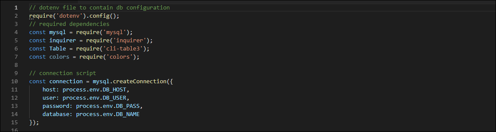
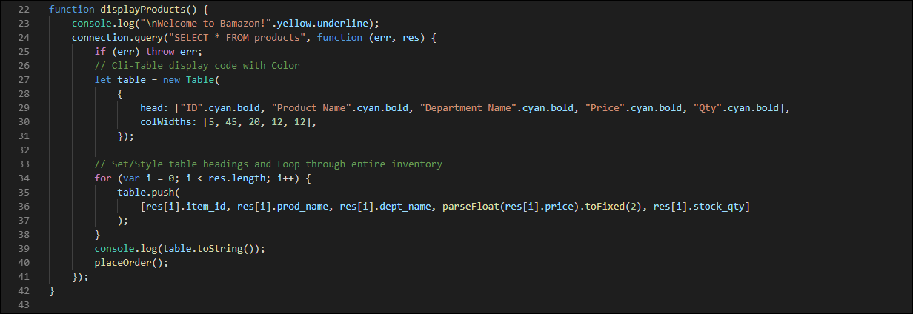
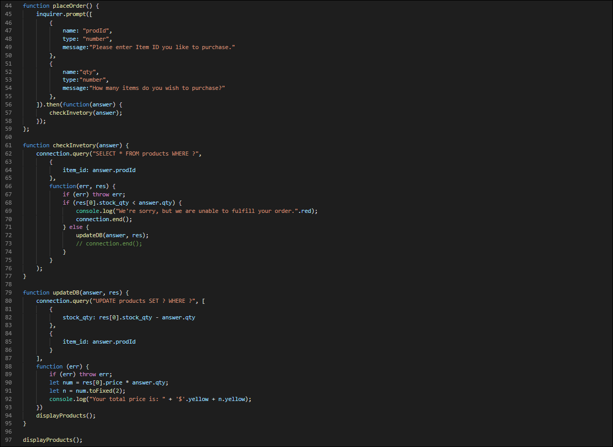
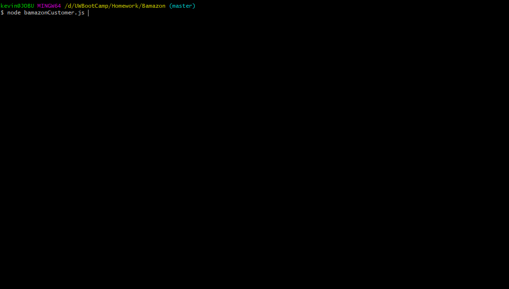

# Bamazon
Welcome to Bamazon an Amazon-like storefront! Only you can't buy real product. This is a command line Node application with a MySQL database for the backend. The purpose of this is to showcase my database and Node JS skills.

## Code Samples

### Config

### Display

### Order, Check Inventory & Update DB

### Demonstration

## Getting Started
These instructions will get you up and running on your local machine for development and testing purposes. See deployment for notes on how to deploy the project on a live system.

### Prerequisites
You will need the following installed...

1. ***Node***
    1. Before you can install Node, you’ll need to install two other applications. Fortunately, once you’ve got these on your machine, installing Node takes just a few minutes.[1]

        1. XCode. Apple’s XCode development software is used to build Mac and iOS apps, but it also includes the tools you need to compile software for use on your Mac. XCode is free and you can find it in the Apple App Store.
            1. Via Terminal `xcode-select --install`

        1. Homebrew. Homebrew is a package manager for the Mac — it makes installing most open source sofware (like Node) as simple as writing brew install node. To install Homebrew just open Terminal and type `ruby -e "$(curl -fsSL https://raw.githubusercontent.com/Homebrew/install/master/install)"`. You’ll see messages in the Terminal explaining what you need to do to complete the installation process.
            1. Now type `brew install node`.

1. ***MySQL Workbench***
    1. It is recommended that you install MySQL Workbench v5.7 as it seems to be the most stable for all systems.
        1. Windows
            1. Go to https://dev.mysql.com/downloads/windows/installer/5.7.html and download the version that matches your architecture.
        1. MacOS
            1. Follow the instructions found here: [MacOS MySQL Workbench Installation](assets/readme/mysqlinstall_mac.md).
    1. Run `Bamazon-schema.sql` in your localhost.

1. ***Running App***
    1. Syntax is as follows...
        1. `node bamazon.js`

### Deployment Notes
Because this is does not run in the browser, you will need to do some setup on your own to get up and rolling.

1. Fork the project
    1. https://github.com/jobu206/Bamazon/fork
1. In your local dir, you will want to run `npm init -y` to install all required packages & generate JSON files.
1. Create a `.env` file to hold your Database Config

## Built With

1. [NodeJS](https://nodejs.org/en/) - The JS framework used.
1. [MySQL](https://dev.mysql.com) - Database of choice.

## Contributing

1. Fork it (https://github.com/jobu206/Bamazon/fork)
1. Create your feature branch `git checkout -b feature/Bamazon`
1. Commit your changes `git commit -am 'Add some yourMessageHere'`
1. Push to the branch `git push origin feature/Bamazon`
1. Create a new Pull Request

## Authors

**Kevin LeRoy** - <a href="https://kevinleroy.me" target="_blank">https://kevinleroy.me</a>

## License

This project is licensed under the MIT License - see the [LICENSE.md](LICENSE.md) file for details

## Acknowledgments

[1] Adapted from instructions found here: <a href="https://blog.teamtreehouse.com/install-node-js-npm-mac" target="_blank">https://blog.teamtreehouse.com/install-node-js-npm-mac</a>